# Проект по тестированию сайта «Ситилинк»

> **Описание проекта:**  
> Проект включает создание тест-плана и тест-кейсов для мануального тестирования в **TMS Zephyr (JIRA)**  
> с разбиением по видам тестирования: `smoke`, `функциональные`, `UI`, `API`.  
> Далее — перевод подходящих тест-кейсов в автоматизацию с использованием **Java 21**, **Selenium/Selenide**,  
> облачных раннеров (**Selenoid / Moon**) и **Allure Report**.  
> Для API-тестов используется **RestAssured**.
>
> В финале тесты интегрируются в **CI/CD (GitHub / Jenkins)**. После прогонов формируется отчёт **Allure**  
> и отправляется в мессенджеры (**Telegram**) со ссылкой на отчёт.
>
> В случае провалов тестов автоматически создаётся **баг-репорт в JIRA** с описанием  
> и ссылками на **Allure** и **билд Jenkins**.

---

## 🎯 Основные цели проекта

### 1️⃣ Планирование тестирования
- Создание **тест-плана** и **тест-кейсов** в TMS Zephyr (JIRA)
- Разделение тестов по типам: `smoke`, `функциональные`, `UI`, `API`

#### 📄 Скриншоты тест-плана
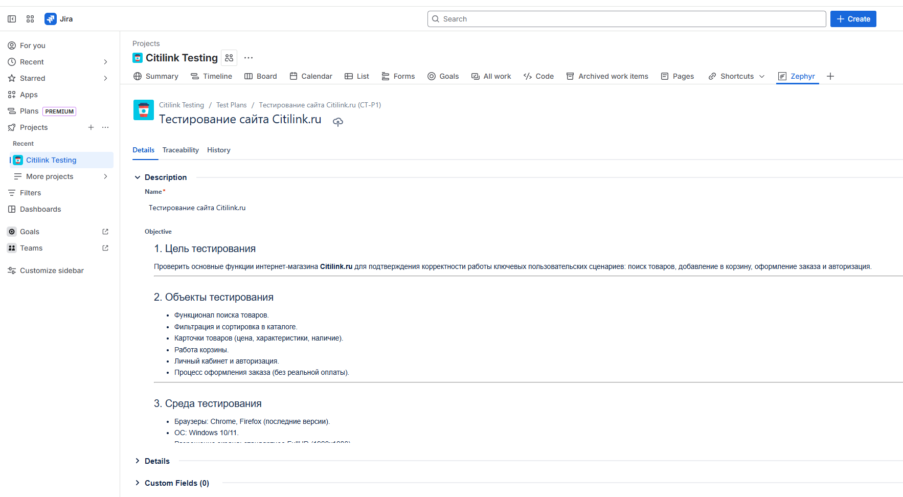  
*Пример тест-плана в Zephyr – обзор тестов и их структура*

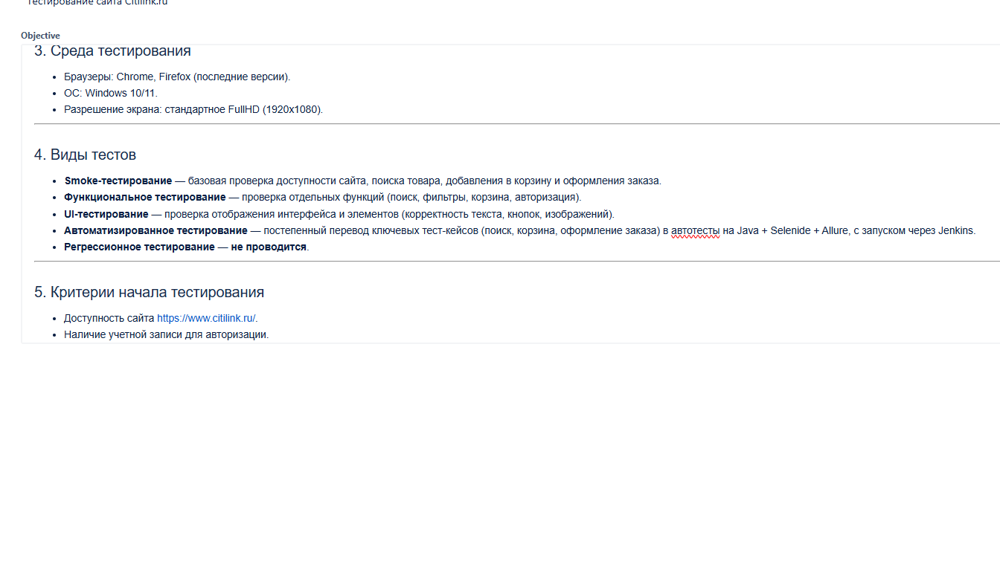  
*Дополнительный вид тест-плана с фильтрацией по типам тестов*

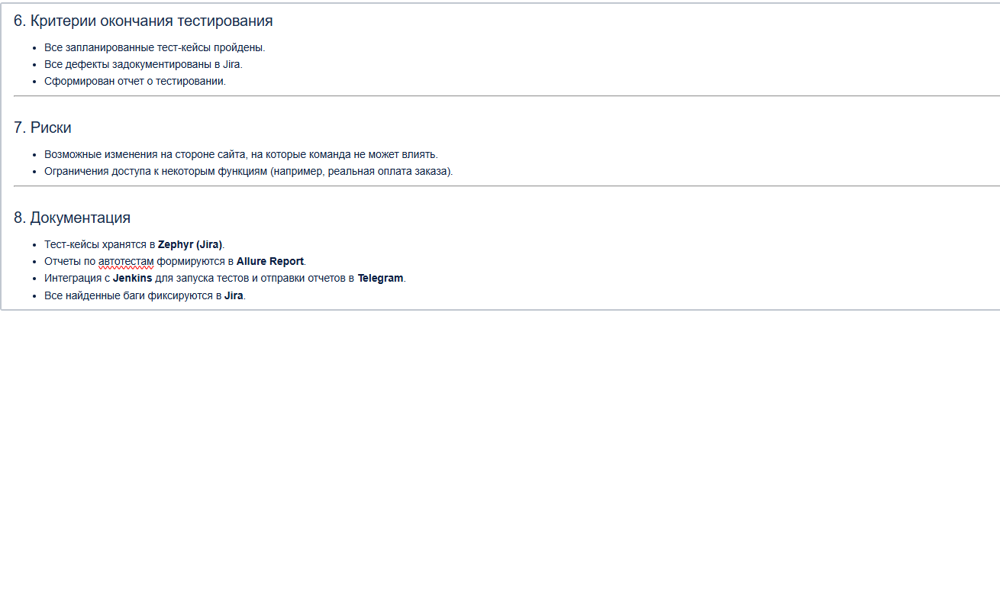  
*Просмотр связей тестов с требованиями / User Stories*

#### 📝 Скриншоты тест-кейсов
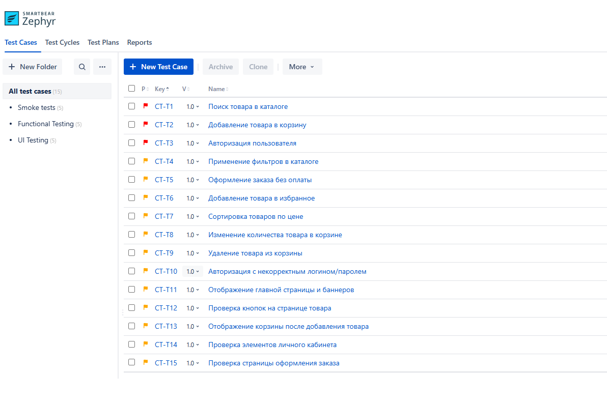  
*Список тест-кейсов с шагами и ожидаемым результатом*

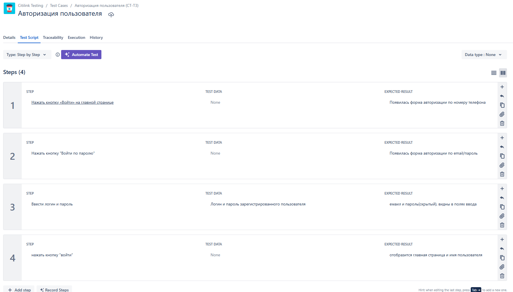  
*Пример раскрытого тест-кейса с подробными шагами выполнения*

---

### 2️⃣ Автоматизация тестов
- Перевод выбранных тест-кейсов в **автотесты** на **Java 17**
- Использование **Selenium / Selenide** для UI
- Облачный запуск тестов через **Selenoid / Moon**
- **API-тесты** с использованием **RestAssured**
- **Allure Report** для логов, скриншотов и видео

#### 📊 Скриншоты Allure Report
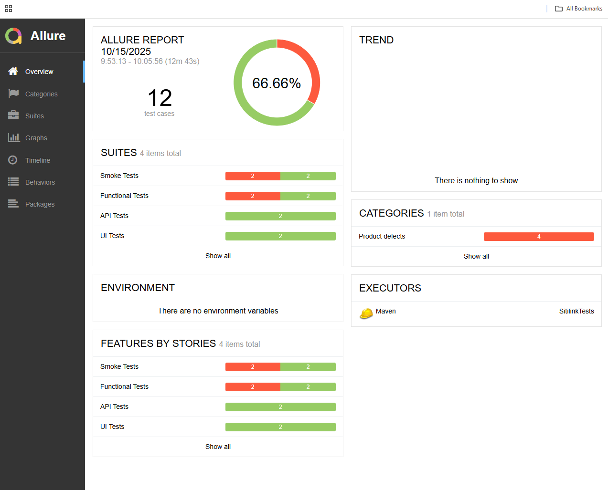  
*Главная страница Allure после прогона тестов с графиком и статистикой*

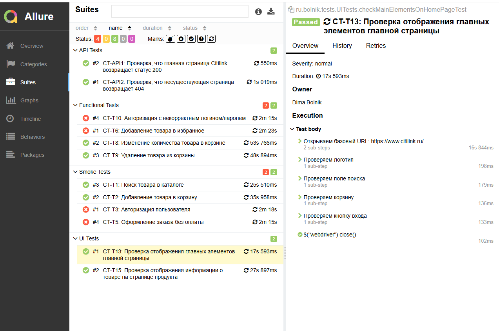  
*Пример успешно пройденного теста с шагами*

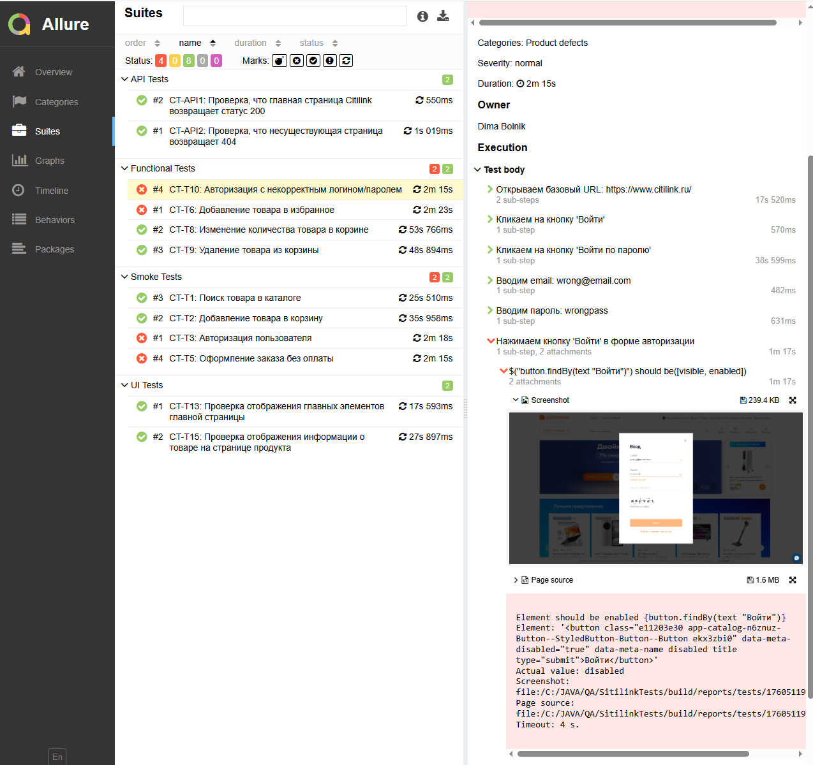  
*Пример упавшего теста с логами и скриншотом*

---

### 3️⃣ Интеграция с CI/CD
- Хранение кода автотестов в **GitHub**
- Настройка **Jenkins** для запуска тестов:
  - по `push` / `pull-request`
  - сборка артефактов: скриншоты, логи
  - генерация **Allure Report** после каждого прогона

#### 📦 Скриншоты Jenkins
  
*Пример успешно пройденного билда с интеграцией автотестов*

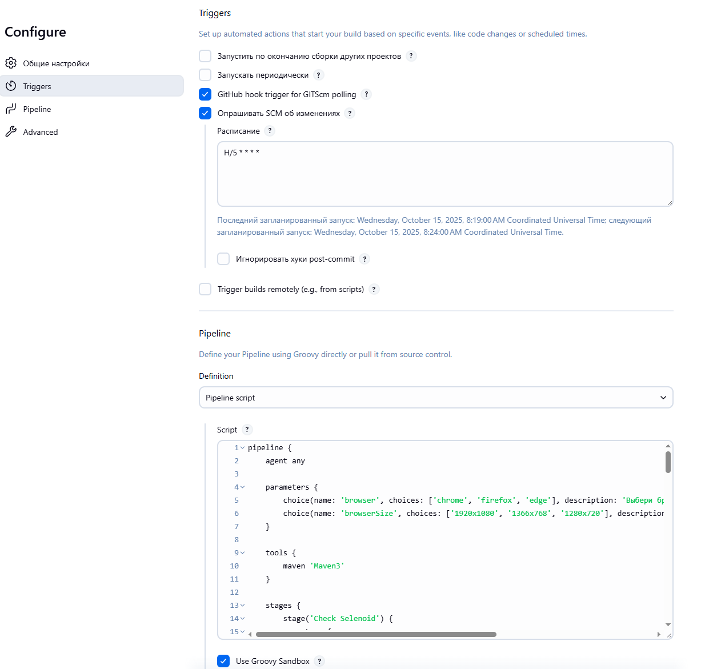  
*Настройки джобы Jenkins с описанием шагов пайплайна и запусков тестов*

---

### 4️⃣ Уведомления и баг-репорты
- Отправка отчёта в **Telegram** с ссылкой на Allure
- При провале тестов автоматическое создание **баг-репорта в JIRA**  
  с шагами воспроизведения и ссылками на билд

#### 📩 Скриншоты уведомлений и багов
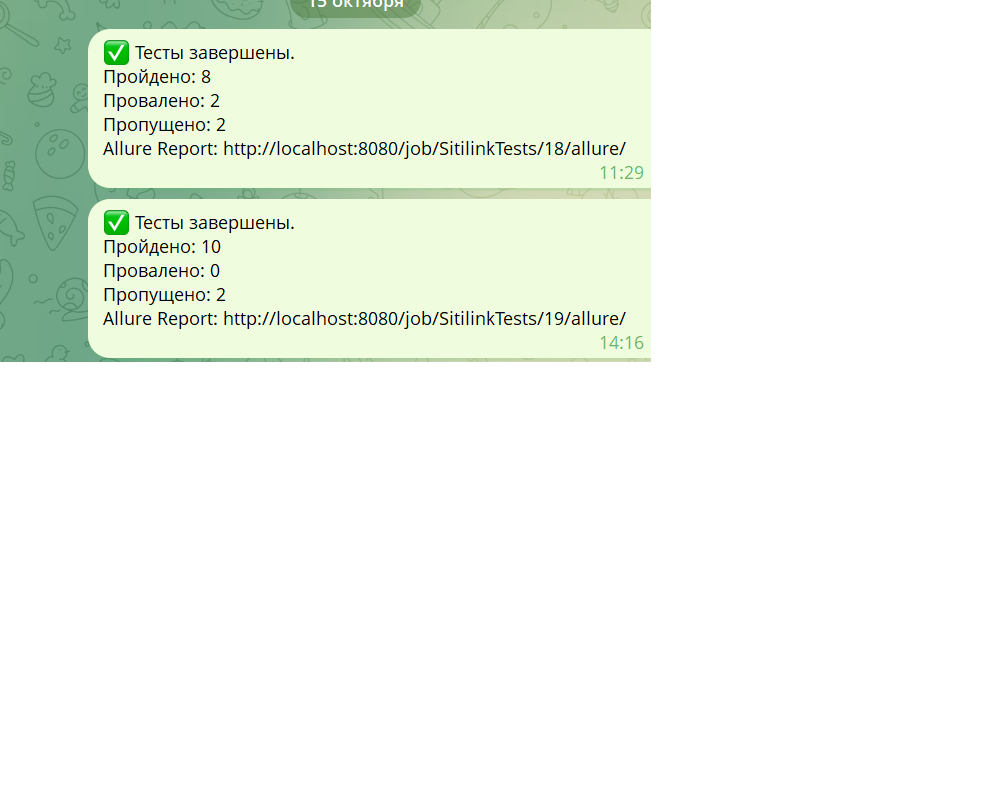  
*Пример уведомления о прогоне тестов с ссылкой на Allure Report и статусом тестов*

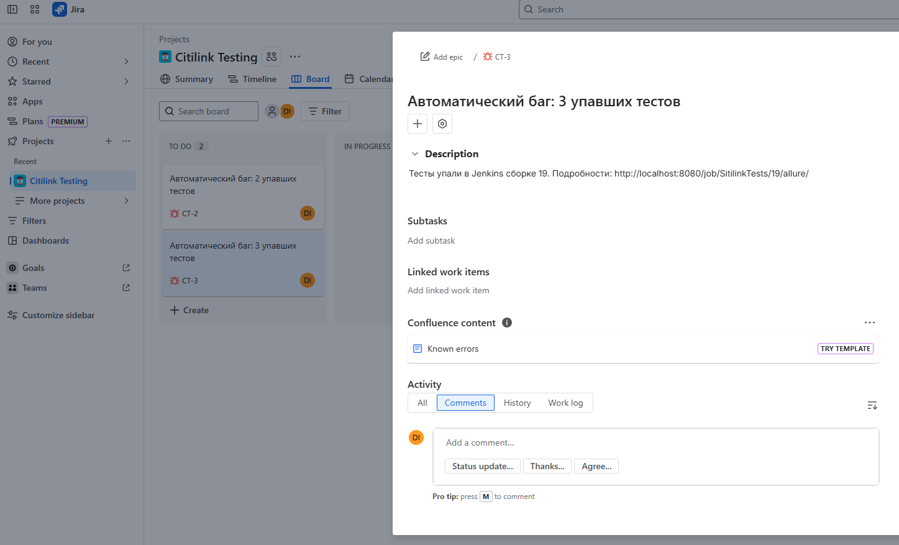  
*Пример автоматически созданного баг-репорта в Jira с описанием и ссылкой на Allure*

---

> 💡 **Итог:**  
> Проект обеспечивает прозрачное тестирование, автоматизацию процессов и быстрый фидбек для команды разработки.


## 🖥 Локальный запуск проекта (Windows)(только тесты с генерацией отчета)

> **Требования перед запуском:**
- **Java 17** или выше установлена и добавлена в `PATH`
- **Chrome** установлен на машине
- **Maven** установлен и настроен в `PATH`
- Пользователь зарегистрирован в системе тестируемого проекта  
  (`login` и `password` будут передаваться через параметры запуска, или некоторые тесты упадут)
 

---

1. **Клонируем репозиторий:**
```powershell
git clone https://github.com/DimaBolnik/SitilinkTests
```

2. **Переходим в папку проекта:**
```powershell
cd SitilinkTests
```

3. **Запуск тестов локально (remote=off):**
```powershell
mvn clean test -Dlogin="<your_login>" -Dpassword="<your_password>" -Dremote=off
```

4. **Запуск тестов на удалённом сервере Selenoid (remote=on):**
```powershell
mvn clean test -Dlogin="<your_login>" -Dpassword="<your_password>" -Dremote=on
```

5. **Генерация Allure отчёта:**
```powershell
mvn allure:serve
```

6. **Просмотр Allure отчёта:**

http://localhost:63666/index.html

Примечание: порт может отличаться, смотрите вывод команды mvn allure:serve.
 
